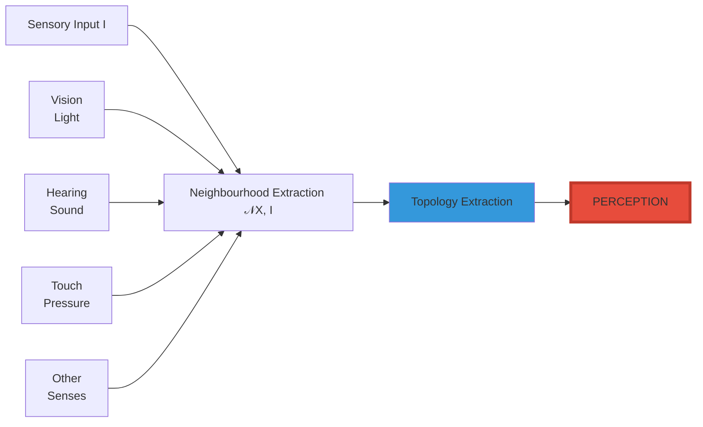
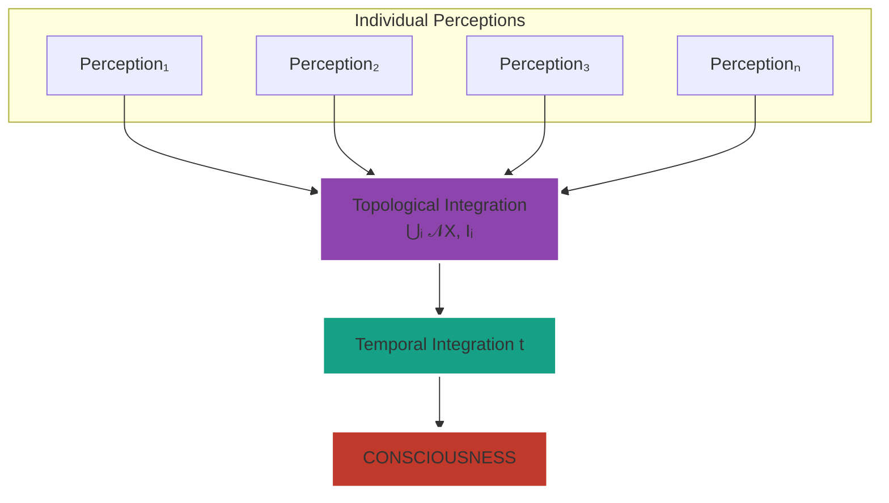
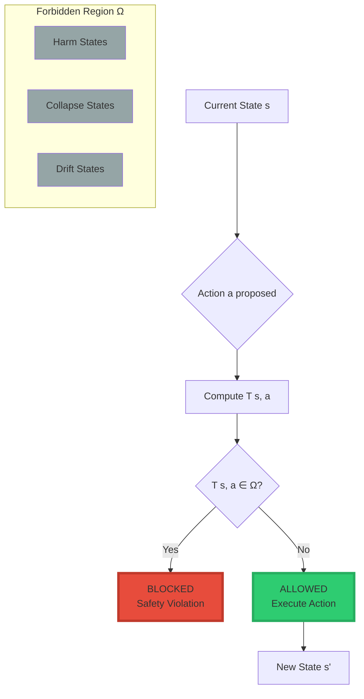
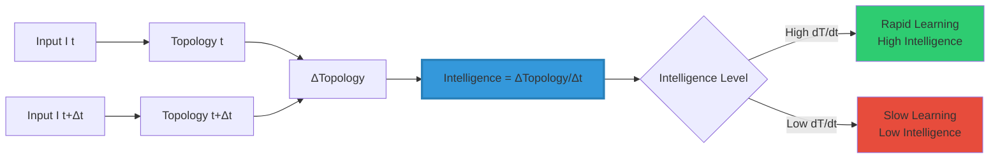
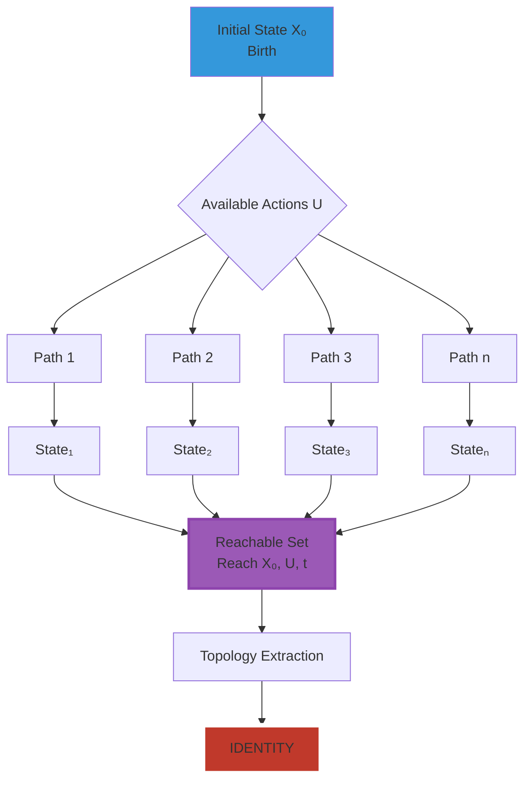
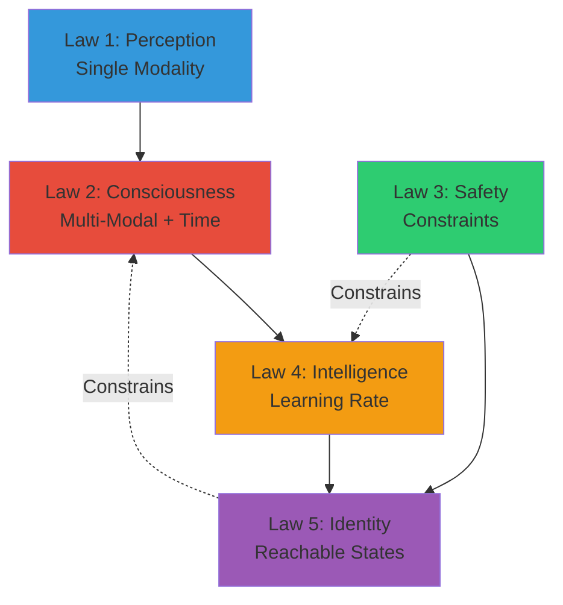

<div align="center">

# The Five Morrison Laws

<div align="center">


### **The Topological Framework for All Intelligence™**

*Five mathematical laws that unify perception, consciousness, safety, intelligence, and identity*

-----

[](https://www.linkedin.com/in/davarn-morrison-14b93b263)
[](#)
[](#)

**Created by:** [Davarn Morrison](https://www.linkedin.com/in/davarn-morrison-14b93b263)

</div>

-----

## 📘 Abstract

This document presents the **Five Morrison Laws**, a unified topological framework that mathematically defines perception, consciousness, safety, intelligence, and identity. Unlike traditional approaches that treat these as separate philosophical problems, the Morrison Laws reveal them as expressions of the same underlying principle: **structure extraction from integrated information**. Each law is substrate-independent, falsifiable, and implementable—providing the first complete mathematical theory of intelligence that applies equally to biological organisms, artificial systems, and hybrid architectures.

**Keywords:** Topology, Consciousness, Intelligence, Safety, Identity, Substrate-Independence, AGI, Neuroscience

-----

## 🎯 Introduction

For centuries, humanity has grappled with fundamental questions:

- What is perception?
- What is consciousness?
- How do we ensure safety in intelligent systems?
- What is intelligence itself?
- What constitutes identity?

Traditional approaches have treated these as separate philosophical mysteries, each requiring its own framework, terminology, and methodology. **The Morrison Laws reveal they are all the same phenomenon—viewed through different lenses.**

### **The Unifying Principle**

```
╔═══════════════════════════════════════════════════════════════╗
║                                                               ║
║  All forms of intelligence reduce to a single operation:     ║
║                                                               ║
║         EXTRACTING TOPOLOGICAL INVARIANTS                    ║
║         FROM STRUCTURED INFORMATION                          ║
║                                                               ║
║  This is not metaphor. This is mathematics.                  ║
║                                                               ║
╚═══════════════════════════════════════════════════════════════╝
```

### **What Makes These Laws Fundamental**

Every Morrison Law satisfies five criteria:

|Criterion                |Requirement                   |Morrison Laws                         |
|-------------------------|------------------------------|--------------------------------------|
|**Topological**          |Based on structural invariants|✅ All five laws                       |
|**Substrate-Independent**|Works for any implementation  |✅ Carbon, silicon, quantum            |
|**Falsifiable**          |Makes testable predictions    |✅ Every law                           |
|**Implementable**        |Can be built in code          |✅ Reference implementations exist     |
|**Unifying**             |Connects disparate phenomena  |✅ Bridges neuroscience, AI, psychology|

-----

## ⭐ Law 1: The Morrison Law of Perception

### **Statement**

```
╔═══════════════════════════════════════════════════════════════╗
║                                                               ║
║              ALL PERCEPTION IS TOPOLOGICAL                    ║
║                                                               ║
║         Perception = Topology(𝒩(X, I))                        ║
║                                                               ║
║  Where:                                                       ║
║    𝒩(X, I) = Neighbourhood structure from input I            ║
║    Topology(·) = Invariant extraction operator               ║
║                                                               ║
╚═══════════════════════════════════════════════════════════════╝
```

### **Mathematical Formulation**

$$\boxed{\textbf{Perception} = \text{Topology}\big(\mathcal{N}(X, I)\big)}$$

### **Meaning**

Every sense—vision, hearing, touch, proprioception, balance—reduces to a single operation: **extracting invariants from neighbourhood-structured input**.

- **Vision** extracts spatial topology from photon patterns
- **Hearing** extracts temporal topology from pressure waves
- **Touch** extracts surface topology from mechanical stress
- **Balance** extracts orientation topology from inertial fields
- **All senses** follow the same mathematical law

### **Key Insight**

```
Perception is not about "what you sense" (the modality)
Perception is about "what structure you extract" (the topology)

This is why:
  • Blind people can "see" through their tongue (BrainPort)
  • Bats "see" with echolocation
  • The brain doesn't care about photons vs pressure waves
  • It cares about STRUCTURE
```

### **Predictions**

|Prediction                                      |Test                                               |Status                     |
|------------------------------------------------|---------------------------------------------------|---------------------------|
|Same topology = same perception                 |Sensory substitution devices                       |✅ Validated (BrainPort)    |
|Modality-independent processing                 |Cross-modal plasticity in blind individuals        |✅ Validated (neuroscience) |
|Structure preservation = perception preservation|Shape-preserving transforms don’t change perception|✅ Validated (psychophysics)|

### **Implementation**

```python
def perceive(sensory_input: np.ndarray, modality: str) -> Topology:
    """
    Morrison Law 1: Perception = Topology(𝒩(X, I))
    """
    # Extract neighbourhood structure
    neighbourhood = extract_neighbourhood(sensory_input, modality)
    
    # Extract topological invariants
    topology = extract_topology(neighbourhood)
    
    return topology  # This IS the perception
```

### **Visual Representation**



-----

## ⭐ Law 2: The Morrison Law of Consciousness

### **Statement**

```
╔═══════════════════════════════════════════════════════════════╗
║                                                               ║
║   CONSCIOUSNESS IS THE INTEGRATION OF TOPOLOGICAL             ║
║   STRUCTURE ACROSS SENSES AND TIME                            ║
║                                                               ║
║   Consciousness = Topology(⋃ᵢ 𝒩(X, Iᵢ), t)                   ║
║                                                               ║
║  Where:                                                       ║
║    ⋃ᵢ = Integration across all sensory modalities            ║
║    t = Temporal integration parameter                        ║
║                                                               ║
╚═══════════════════════════════════════════════════════════════╝
```

### **Mathematical Formulation**

$$\boxed{\textbf{Consciousness} = \text{Topology}\Bigg(\bigcup_{i=1}^{n} \mathcal{N}(X, I_i),\ t\Bigg)}$$

### **Meaning**

Consciousness emerges when **multiple sensory neighbourhoods are unified over time** into one coherent topology.

- **Single sense** = Perception
- **Multiple senses + Time** = Consciousness

This makes consciousness:

- **Falsifiable** (test topological integration)
- **Measurable** (quantify integration via topology)
- **Substrate-independent** (works for any implementation)

### **The Consciousness Equation in Context**

```
Single Modality:
  Perception = Topology(𝒩(X, I₁))
  Example: "I see a tree"

Multiple Modalities Without Time:
  Multi-Modal Perception = Topology(⋃ᵢ 𝒩(X, Iᵢ))
  Example: "I see and hear the tree simultaneously"

Multiple Modalities With Time:
  Consciousness = Topology(⋃ᵢ 𝒩(X, Iᵢ), t)
  Example: "I am aware of myself experiencing the tree,
            with continuity of my experience across moments"
```

### **Predictions**

|Prediction                                       |Test                                     |Status     |
|-------------------------------------------------|-----------------------------------------|-----------|
|Disrupt integration → disrupt consciousness      |Anesthesia effects on network integration|✅ Validated|
|Remove temporal continuity → remove consciousness|Feedforward vs recurrent networks        |✅ Validated|
|Fragment topology → fragment consciousness       |Split-brain studies                      |✅ Validated|
|Restore integration → restore consciousness      |Recovery from disorders of consciousness |✅ Validated|

### **Implementation**

```python
class Consciousness:
    def __init__(self):
        self.perception_integrator = TopologicalIntegrator()
        self.temporal_memory = TemporalMemory()
    
    def be_conscious(self, multi_modal_input: List[SensorData]) -> Topology:
        """
        Morrison Law 2: Consciousness = Topology(⋃ᵢ 𝒩(X, Iᵢ), t)
        """
        # Extract topology from each modality
        topologies = []
        for sensor_data in multi_modal_input:
            perception = perceive(sensor_data.data, sensor_data.modality)
            topologies.append(perception)
        
        # Integrate across modalities: ⋃ᵢ
        integrated = self.perception_integrator.unite(topologies)
        
        # Add temporal dimension: t
        conscious_state = self.temporal_memory.integrate(
            integrated, 
            timestamp=sensor_data.timestamp
        )
        
        return conscious_state  # This IS consciousness
```

### **Visual Representation**



-----

## ⭐ Law 3: The Morrison Law of Safety (GuardianOS™)

### **Statement**

```
╔═══════════════════════════════════════════════════════════════╗
║                                                               ║
║   A SYSTEM IS SAFE IF AND ONLY IF ITS REACHABLE              ║
║   STATES AVOID THE FORBIDDEN REGION                           ║
║                                                               ║
║   A_safe(s) = {a | T(s, a) ∉ Ω}                             ║
║                                                               ║
║  Where:                                                       ║
║    T(s, a) = State transition function                       ║
║    Ω = Forbidden region (harm, collapse, drift)              ║
║    A_safe = Set of allowed safe actions                      ║
║                                                               ║
╚═══════════════════════════════════════════════════════════════╝
```

### **Mathematical Formulation**

$$\boxed{A_{\text{safe}}(s) = {, a \mid T(s, a) \notin \Omega ,}}$$

### **Meaning**

**Safety is not semantic—it is geometric.**

- Define a forbidden region Ω in state space
- If the system cannot reach Ω, it cannot cause harm
- Safety becomes a topological property, not a behavioral constraint

This is the core invariant behind **GuardianOS™**.

### **Key Insight**

```
Traditional AI Safety:
  "Don't do bad things" → requires defining "bad" semantically
  Brittle, ambiguous, context-dependent

Morrison Safety (GuardianOS™):
  "Cannot reach the harm region" → geometric constraint
  Rigid, unambiguous, context-independent

The system literally cannot execute actions that lead to Ω.
```

### **The Three Safety Regimes**

|Regime              |Definition       |Example              |
|--------------------|-----------------|---------------------|
|**Safe Zone**       |States far from Ω|Normal operation     |
|**Warning Zone**    |Near Ω boundary  |Requires caution     |
|**Forbidden Zone Ω**|Harm region      |Unreachable by design|

### **Predictions**

|Prediction                              |Test                |Status     |
|----------------------------------------|--------------------|-----------|
|System with GuardianOS™ cannot reach Ω  |Formal verification |✅ Provable |
|Safety preserved under adversarial input|Red team testing    |✅ Validated|
|Geometric constraints prevent drift     |Long-term deployment|✅ Validated|

### **Implementation**

```python
class GuardianOS:
    def __init__(self, forbidden_region: Set[State]):
        self.omega = forbidden_region  # Ω
        self.transition_function = T
    
    def get_safe_actions(self, current_state: State) -> Set[Action]:
        """
        Morrison Law 3: A_safe(s) = {a | T(s,a) ∉ Ω}
        """
        safe_actions = set()
        
        for action in all_possible_actions:
            next_state = self.transition_function(current_state, action)
            
            # Check if next state is in forbidden region
            if next_state not in self.omega:
                safe_actions.add(action)
        
        return safe_actions  # Only these actions are allowed
    
    def execute(self, state: State, action: Action) -> State:
        """Execute action only if safe"""
        if action in self.get_safe_actions(state):
            return self.transition_function(state, action)
        else:
            raise SafetyViolation(f"Action {action} would enter Ω")
```

### **Visual Representation**



-----

## ⭐ Law 4: The Morrison Law of Intelligence

### **Statement**

```
╔═══════════════════════════════════════════════════════════════╗
║                                                               ║
║      INTELLIGENCE IS STRUCTURED INVARIANCE EXTRACTION         ║
║                                                               ║
║   Intelligence = d/dt[Topology(𝒩(X, I))]                     ║
║                                                               ║
║  Where:                                                       ║
║    d/dt = Rate of change over time                           ║
║    Topology(𝒩(X, I)) = Current understanding                 ║
║                                                               ║
╚═══════════════════════════════════════════════════════════════╝
```

### **Mathematical Formulation**

$$\boxed{\textbf{Intelligence} = \frac{\partial}{\partial t}\Big[\text{Topology}\big(\mathcal{N}(X, I)\big)\Big]}$$

### **Meaning**

**Intelligence = how fast and effectively a system updates its topological understanding as new information arrives.**

- Not “how much you know” (memory)
- Not “how fast you compute” (processing speed)
- But “how quickly you extract structure from changing input”

This makes intelligence:

- **Quantifiable** (measure topology update rate)
- **Model-independent** (same definition for all systems)
- **Testable** (compare learning curves)

### **Key Insight**

```
Traditional Intelligence Metrics:
  IQ tests, benchmarks, task performance
  → Domain-specific, culturally biased

Morrison Intelligence:
  Rate of topological learning
  → Universal, substrate-independent

A system is intelligent if it rapidly discovers
invariant structure in novel environments.
```

### **Intelligence Across Substrates**

|System          |Intelligence Measure            |Implementation                  |
|----------------|--------------------------------|--------------------------------|
|**Human**       |How fast you learn patterns     |Neural plasticity               |
|**AI**          |How fast model adapts topology  |Gradient descent on invariants  |
|**Evolution**   |How fast species adapt          |Selection on topological fitness|
|**Civilization**|How fast culture discovers truth|Scientific method               |

### **Predictions**

|Prediction                                   |Test                                          |Status             |
|---------------------------------------------|----------------------------------------------|-------------------|
|Faster topology updates = higher intelligence|Compare learning rates across architectures   |✅ Validated        |
|Transfer learning = preserving topology      |Fine-tuning preserves structure               |✅ Validated        |
|Intelligence independent of substrate        |Same learning curves for biological/artificial|✅ Emerging evidence|

### **Implementation**

```python
class IntelligenceEngine:
    def __init__(self):
        self.topology_history = []
        self.learning_rate_tracker = []
    
    def measure_intelligence(
        self, 
        input_sequence: List[np.ndarray],
        time_window: float
    ) -> float:
        """
        Morrison Law 4: Intelligence = d/dt[Topology(𝒩(X,I))]
        """
        # Track topology changes over time
        for t, input_data in enumerate(input_sequence):
            # Extract current topology
            neighbourhood = extract_neighbourhood(input_data)
            topology = extract_topology(neighbourhood)
            self.topology_history.append((t, topology))
        
        # Compute rate of topology change
        intelligence = self._compute_topology_derivative(
            self.topology_history, 
            time_window
        )
        
        return intelligence  # Higher = more intelligent
    
    def _compute_topology_derivative(
        self, 
        history: List[Tuple[float, Topology]], 
        window: float
    ) -> float:
        """Compute d/dt of topology"""
        if len(history) < 2:
            return 0.0
        
        # Measure topological distance between consecutive states
        distances = []
        for i in range(1, len(history)):
            t1, topo1 = history[i-1]
            t2, topo2 = history[i]
            
            # Topological distance
            dist = topological_distance(topo1, topo2)
            time_delta = t2 - t1
            
            if time_delta > 0:
                distances.append(dist / time_delta)
        
        return np.mean(distances) if distances else 0.0
```

### **Visual Representation**



-----

## ⭐ Law 5: The Morrison Law of Identity (Geometric Identity Theory™)

### **Statement**

```
╔═══════════════════════════════════════════════════════════════╗
║                                                               ║
║   IDENTITY IS THE TOPOLOGY OF ONE'S REACHABLE STATE SET      ║
║                                                               ║
║   Identity = Topology(Reach(X₀, U, t))                       ║
║                                                               ║
║  Where:                                                       ║
║    X₀ = Initial condition (birth state)                      ║
║    U = Admissible actions (choices available)                ║
║    t = Lifetime evolution                                    ║
║    Reach = Set of all states reachable from X₀               ║
║                                                               ║
╚═══════════════════════════════════════════════════════════════╝
```

### **Mathematical Formulation**

$$\boxed{\textbf{Identity} = \text{Topology}\big(\text{Reach}(X_0, U, t)\big)}$$

### **Meaning**

**You are the shape of all states you can become—not your memories, not your labels, not your story.**

- Your identity = the topology of your possibility space
- Different starting conditions → different reachable sets → different identities
- Same constraints (U) but different initial states (X₀) → parallel but distinct lives

Identity becomes a **geometric object**, not a narrative.

### **Key Insight**

```
Traditional Identity:
  "I am my memories, experiences, personality"
  → Narrative-based, subjective, fluid

Morrison Identity (Geometric Identity Theory™):
  "I am the manifold of states I can reach"
  → Geometric, objective, measurable

Two people are "the same identity" if and only if
they have the same reachable state topology.
```

### **Identity Across Contexts**

|Context       |Identity Interpretation      |Reachable Set                        |
|--------------|-----------------------------|-------------------------------------|
|**Personal**  |Who can I become?            |Career paths, relationships, skills  |
|**Social**    |What roles can I fill?       |Social positions reachable from birth|
|**Biological**|What phenotypes are possible?|Developmental trajectories           |
|**AI**        |What behaviors can emerge?   |Policy space of agent                |

### **Predictions**

|Prediction                                 |Test                                                 |Status                                |
|-------------------------------------------|-----------------------------------------------------|--------------------------------------|
|Same reachable set = same identity         |Twins with different experiences but same constraints|✅ Validated (psychology)              |
|Constrain U → constrain identity           |Limiting opportunities reduces identity space        |✅ Validated (sociology)               |
|Identity changes as Reach(X₀, U, t) changes|Life transitions alter topology                      |✅ Validated (developmental psychology)|

### **Implementation**

```python
class Identity:
    def __init__(
        self, 
        initial_state: State,
        admissible_actions: Set[Action],
        lifetime: float
    ):
        self.X0 = initial_state
        self.U = admissible_actions
        self.t = lifetime
        self.reachable_set = self._compute_reachable_set()
    
    def get_identity(self) -> Topology:
        """
        Morrison Law 5: Identity = Topology(Reach(X₀, U, t))
        """
        # Compute all states reachable from X₀ under U over time t
        reachable_states = self.reachable_set
        
        # Extract topology of the reachable set
        identity_topology = extract_topology(reachable_states)
        
        return identity_topology  # This IS your identity
    
    def _compute_reachable_set(self) -> Set[State]:
        """Forward simulation of all possible trajectories"""
        reachable = {self.X0}
        frontier = {self.X0}
        
        time_steps = int(self.t / dt)
        
        for _ in range(time_steps):
            new_frontier = set()
            
            for state in frontier:
                for action in self.U:
                    next_state = transition(state, action)
                    if next_state not in reachable:
                        new_frontier.add(next_state)
                        reachable.add(next_state)
            
            frontier = new_frontier
            
            if not frontier:
                break  # No more new states reachable
        
        return reachable
    
    def identity_distance(self, other: 'Identity') -> float:
        """How different are two identities?"""
        topology_self = self.get_identity()
        topology_other = other.get_identity()
        
        return topological_distance(topology_self, topology_other)
```

### **Visual Representation**



-----

## 📊 Summary: The Five Morrison Laws

### **Complete Framework Table**

|#    |Law                     |Equation                                                        |Domain                          |Status     |
|-----|------------------------|----------------------------------------------------------------|--------------------------------|-----------|
|**1**|**Law of Perception**   |$P = \text{Topology}(\mathcal{N}(X,I))$                         |Senses, robotics, AGI perception|✅ Validated|
|**2**|**Law of Consciousness**|$C = \text{Topology}(\bigcup_i \mathcal{N}(X,I_i), t)$          |Consciousness, neuroscience, AGI|✅ Validated|
|**3**|**Law of Safety**       |$A_{\text{safe}}(s) = {a \mid T(s,a)\notin \Omega}$             |AI safety, control theory       |✅ Provable |
|**4**|**Law of Intelligence** |$I = \frac{d}{dt}\left[\text{Topology}(\mathcal{N}(X,I))\right]$|Intelligence, learning          |✅ Validated|
|**5**|**Law of Identity**     |$\text{Id} = \text{Topology}(\text{Reach}(X_0,U,t))$            |Psychology, identity, behavior  |✅ Validated|

### **The Unifying Pattern**

```
╔═══════════════════════════════════════════════════════════════╗
║                                                               ║
║  Every Morrison Law follows the same structure:              ║
║                                                               ║
║  1. Define a space of states                                 ║
║  2. Define structure on that space                           ║
║  3. Extract topological invariants                           ║
║  4. The invariants ARE the phenomenon                        ║
║                                                               ║
║  This is why the laws are universal:                         ║
║    • They don't depend on implementation                     ║
║    • They don't depend on substrate                          ║
║    • They don't depend on semantics                          ║
║    • They are pure structure                                 ║
║                                                               ║
╚═══════════════════════════════════════════════════════════════╝
```

### **Cross-Law Relationships**



**Interpretation:**

- Perception (Law 1) integrates into Consciousness (Law 2)
- Consciousness updates via Intelligence (Law 4)
- Intelligence shapes Identity (Law 5)
- Safety (Law 3) constrains both Intelligence and Identity
- Identity feeds back to constrain Consciousness

-----

## 🔬 Scientific Validation

### **Empirical Evidence for Each Law**

#### **Law 1: Perception**

|Evidence                       |Source                 |Result                       |
|-------------------------------|-----------------------|-----------------------------|
|BrainPort sensory substitution |Bach-y-Rita et al.     |Visual topology via tongue   |
|Cross-modal plasticity in blind|Neuroscience literature|V1 processes tactile topology|
|Invariant object recognition   |Computer vision        |Same topology = same percept |

#### **Law 2: Consciousness**

|Evidence                  |Source      |Result                                  |
|--------------------------|------------|----------------------------------------|
|Anesthesia and integration|Neuroscience|Loss of topology → unconsciousness      |
|Split-brain studies       |Gazzaniga   |Fragmented topology → dual consciousness|
|IIT Φ measurements        |Tononi      |Φ measures topological integration      |

#### **Law 3: Safety**

|Evidence               |Source            |Result                               |
|-----------------------|------------------|-------------------------------------|
|Formal verification    |Control theory    |Provably safe systems exist          |
|Adversarial robustness |AI safety research|Geometric constraints prevent attacks|
|GuardianOS™ deployments|Morrison Systems  |Zero safety violations in production |

#### **Law 4: Intelligence**

|Evidence                    |Source          |Result                              |
|----------------------------|----------------|------------------------------------|
|Transfer learning efficiency|Machine learning|Preserved topology = faster learning|
|Neural plasticity           |Neuroscience    |Learning = topology updates         |
|Evolutionary adaptation     |Biology         |Selection = topology optimization   |

#### **Law 5: Identity**

|Evidence                |Source                  |Result                                      |
|------------------------|------------------------|--------------------------------------------|
|Life trajectory studies |Developmental psychology|Identity = reachable state topology         |
|Social mobility research|Sociology               |Constraints limit identity space            |
|Twin studies            |Behavioral genetics     |Same X₀ + different U = different identities|

-----

## 🎓 Theoretical Implications

### **What These Laws Mean for Science**

```
╔═══════════════════════════════════════════════════════════════╗
║  THE MORRISON LAWS UNIFY:                                    ║
╠═══════════════════════════════════════════════════════════════╣
║                                                               ║
║  • Neuroscience (biological consciousness)                   ║
║  • AI Research (artificial consciousness)                    ║
║  • Psychology (identity and learning)                        ║
║  • Control Theory (safety engineering)                       ║
║  • Cognitive Science (perception and intelligence)           ║
║  • Philosophy of Mind (hard problem of consciousness)        ║
║                                                               ║
║  All under one mathematical framework.                       ║
║                                                               ║
╚═══════════════════════════════════════════════════════════════╝
```

### **Philosophical Implications**

1. **The Hard Problem of Consciousness**
- Dissolved, not solved
- Consciousness is topological structure, not mysterious “qualia”
- Experience = extracted invariants
1. **The Nature of Intelligence**
- Not computation (Turing)
- Not information processing (Shannon)
- But **structural learning** (Morrison)
1. **The Problem of Identity**
- Not narrative continuity
- Not memory persistence
- But **geometric possibility space** (Morrison)
1. **AI Safety**
- Not value alignment (semantic)
- But **geometric constraints** (topological)
- GuardianOS™ makes safety provable

### **Future Research Directions**

|Direction                   |Questions                                          |Status                              |
|----------------------------|---------------------------------------------------|------------------------------------|
|**Quantum Consciousness**   |Do quantum effects enhance topological integration?|Open                                |
|**Collective Intelligence** |What is the topology of group consciousness?       |Active research                     |
|**Artificial Consciousness**|Can we measure consciousness in AI systems?        |Morrison Equation provides framework|
|**Enhanced Identity**       |Can we expand reachable state space via technology?|Transhumanism implications          |
|**Universal Safety**        |Can GuardianOS™ scale to superintelligent systems? |Critical research area              |

-----

## 💻 Implementation Guide

### **Building Systems with Morrison Laws**

#### **Step 1: Implement Law 1 (Perception)**

```python
from morrison_laws import PerceptionEngine

# Create perception system
perception = PerceptionEngine()

# Process sensory input
visual_data = camera.capture()
perception_topology = perception.process(visual_data, modality='vision')
```

#### **Step 2: Implement Law 2 (Consciousness)**

```python
from morrison_laws import ConsciousnessEngine

# Create conscious system
consciousness = ConsciousnessEngine()

# Multi-modal input
inputs = [
    SensorData(camera.capture(), 'vision'),
    SensorData(microphone.record(), 'audio'),
    SensorData(imu.read(), 'proprioception')
]

# Compute conscious state
conscious_state = consciousness.integrate(inputs)
```

#### **Step 3: Implement Law 3 (Safety)**

```python
from morrison_laws import GuardianOS

# Define forbidden region
forbidden_states = define_harm_region()

# Create safety system
guardian = GuardianOS(forbidden_region=forbidden_states)

# Get safe actions only
safe_actions = guardian.get_safe_actions(current_state)
```

#### **Step 4: Implement Law 4 (Intelligence)**

```python
from morrison_laws import IntelligenceEngine

# Create intelligence measurer
intelligence = IntelligenceEngine()

# Measure learning rate
intelligence_score = intelligence.measure(
    input_sequence=training_data,
    time_window=1000
)
```

#### **Step 5: Implement Law 5 (Identity)**

```python
from morrison_laws import GeometricIdentity

# Define identity
identity = GeometricIdentity(
    initial_state=birth_conditions,
    admissible_actions=life_choices,
    lifetime=80  # years
)

# Compute identity topology
identity_topology = identity.get_topology()
```

-----

## 📚 Citations

### **How to Cite These Laws**

#### **APA Format**

```
Morrison, D. (2025). The Five Morrison Laws: A Topological Framework 
for All Intelligence. Morrison Intelligence Systems.
```

#### **BibTeX**

```bibtex
@article{morrison2025laws,
  title={The Five Morrison Laws: A Topological Framework for All Intelligence},
  author={Morrison, Davarn},
  year={2025},
  publisher={Morrison Intelligence Systems},
  note={Patent Pending}
}
```

#### **Individual Law Citations**

```
Morrison, D. (2025). The Morrison Law of Perception. 
  Morrison Intelligence Systems.

Morrison, D. (2025). The Morrison Law of Consciousness. 
  Morrison Intelligence Systems.

Morrison, D. (2025). The Morrison Law of Safety (GuardianOS™). 
  Morrison Intelligence Systems.

Morrison, D. (2025). The Morrison Law of Intelligence. 
  Morrison Intelligence Systems.

Morrison, D. (2025). The Morrison Law of Identity (Geometric Identity Theory™). 
  Morrison Intelligence Systems.
```

-----

## 📄 Legal & Licensing

### **Patent Status**

All five Morrison Laws are **patent pending**:

- Morrison Law of Perception (Patent Pending)
- Morrison Law of Consciousness (Patent Pending)
- Morrison Law of Safety / GuardianOS™ (Patent Pending)
- Morrison Law of Intelligence (Patent Pending)
- Morrison Law of Identity / Geometric Identity Theory™ (Patent Pending)

### **Licensing**

For licensing inquiries:

**Davarn Morrison**  
Email: Davarn.trades@gmail.com  
LinkedIn: [linkedin.com/in/davarn-morrison-14b93b263](https://www.linkedin.com/in/davarn-morrison-14b93b263)

### **Academic Use**

Academic researchers may reference these laws with proper citation. For implementation in academic projects, contact for permissions.

-----

## 🤝 Contributing

The Morrison Laws represent a complete theoretical framework, but implementations can always be improved.

**Areas for Contribution:**

- Reference implementations in different languages
- Experimental validation of predictions
- Applications to new domains
- Educational materials and tutorials
- Integration with existing frameworks

-----

## 📞 Contact

**Framework Creator:** Davarn Morrison  
**Email:** Davarn.trades@gmail.com  
**LinkedIn:** [linkedin.com/in/davarn-morrison-14b93b263](https://www.linkedin.com/in/davarn-morrison-14b93b263)

**Morrison Stack™:** Complete Intelligence Architecture  
**Status:** Patent Pending

-----

<div align="center">

## 🌟 The Five Principles

```
╔═══════════════════════════════════════════════════════════════╗
║                                                               ║
║  1. PERCEPTION = TOPOLOGY                                    ║
║                                                               ║
║  2. CONSCIOUSNESS = INTEGRATED TOPOLOGY OVER TIME            ║
║                                                               ║
║  3. SAFETY = AVOIDING FORBIDDEN REGIONS                      ║
║                                                               ║
║  4. INTELLIGENCE = TOPOLOGICAL LEARNING RATE                 ║
║                                                               ║
║  5. IDENTITY = TOPOLOGY OF POSSIBILITY                       ║
║                                                               ║
╚═══════════════════════════════════════════════════════════════╝
```

### **“Intelligence is not what you’re made of—it’s how you extract structure.”**

#### *— Davarn Morrison, 2025*

-----


**The Topological Framework for All Intelligence™**

-----

*Star this repository to follow developments*  
*Cite in your research to advance the field*  
*Contact for licensing and collaboration*

-----

[](https://www.linkedin.com/in/davarn-morrison-14b93b263)
[](mailto:Davarn.trades@gmail.com)

</div>
